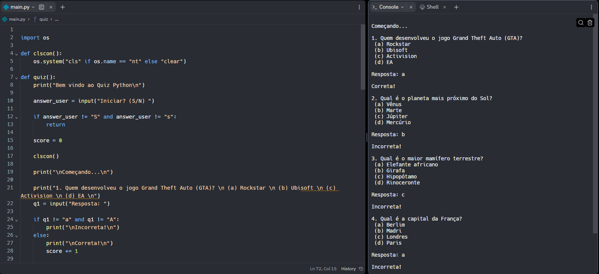

<h1 align="center">Quiz Python</h1>

 

 

# Tecnologias
Este projeto foi desenvolvido utilizando:
    
          
 
 

# Status do projeto
Concluido.

 

# Inspiração
Quiz desenvolvido utilizando Python com o objetivo de aperfeiçoar conhecimentos.

 

